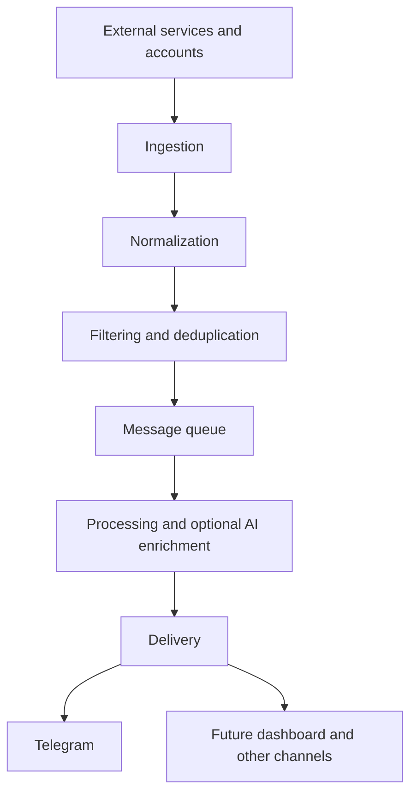

# SignalDesk

An AI-powered notification hub in development, designed to bring important updates from multiple services into one place, starting with Telegram.

## Overview

SignalDesk aims to provide a single place to follow events across connected services and accounts. It will normalize incoming events, reduce noise, and deliver relevant updates, using AI where it helps make messages easier to understand.

The first goal is a practical tool for personal use. The planned modular, event-driven architecture should leave room to grow into a SaaS product for individuals, teams, and businesses.

## Motivation

Important updates are scattered across inboxes, repositories, chat tools, calendars, and monitoring systems. Checking each service takes time, while repeated alerts make meaningful changes harder to notice. SignalDesk aims to reduce that overhead by collecting updates and delivering concise, actionable notifications through a familiar channel.

## Current status

**Scaffolding stage.** The repository contains Python package scaffolds for the backend, AI worker, and Telegram bot, infrastructure placeholders, and design documentation. Python packages share a root `pyproject.toml` declaring FastAPI, Uvicorn, aiogram, SQLAlchemy, asyncpg, and Pydantic. Entry points, Dockerfiles, Compose files, and service configuration are still empty. There is no runnable application or implemented integration yet. The concepts, architecture, stack, and roadmap below describe intended work.

## Core concepts

- **Integration adapters:** Connect external services and accounts while keeping provider-specific behavior separate from the processing pipeline.
- **Common event format:** Normalize source events into a consistent representation while preserving their original title, content, and source reference.
- **Noise reduction:** Filter unwanted events and deduplicate repetitive notifications before further processing.
- **Optional AI enrichment:** Generate concise titles and summaries, suggest priority and classification, and potentially group related events.
- **Delivery independent of AI:** If the AI provider is unavailable or enrichment fails, deliver the original or normalized title and content instead. AI failure must not prevent notification delivery.
- **Independent delivery channels:** Start with Telegram and allow future channels and a dashboard to reuse the same pipeline.

## Planned architecture



A queue is intended to decouple ingestion from processing and delivery, allowing those components to evolve and scale independently. The processing stage should retain usable event content throughout enrichment so delivery can continue without AI.

This is a conceptual design; service boundaries and deployment details have not been implemented.

## Roadmap

- [ ] Define the internal event schema and integration interface.
- [ ] Build an end-to-end path from one source to Telegram, without requiring AI.
- [ ] Add filtering, deduplication, queued processing, and delivery retries.
- [ ] Add optional AI enrichment with fallback behavior and failure-path tests.
- [ ] Expand integration and account support. Candidates include Gmail, Outlook, GitHub, Slack, calendar services, and monitoring systems.
- [ ] Add operational visibility and deployment documentation.
- [ ] Explore a dashboard and additional delivery channels.
- [ ] Prepare for SaaS use through authentication, tenant isolation, and team access controls.

## Tech stack

Python packaging uses a shared `pyproject.toml`, Python 3.12–3.14, and setuptools. FastAPI, Uvicorn, aiogram, SQLAlchemy, asyncpg, and Pydantic are declared dependencies; application behavior and infrastructure are not implemented yet. The table describes their intended roles alongside planned infrastructure:

| Technology | Intended role |
| --- | --- |
| Python / FastAPI | API and ingestion endpoints |
| Next.js | Future dashboard |
| Uvicorn | ASGI server for FastAPI |
| aiogram | Telegram bot |
| SQLAlchemy / asyncpg | Async ORM and PostgreSQL driver |
| Pydantic | Data validation and schemas |
| PostgreSQL | Planned database server for persistent application and event data |
| RabbitMQ | Message queue |
| Redis, where useful | Caching and short-lived state |
| Docker | Containerized development and deployment |
| Nginx | Reverse proxy |
| OpenAI API or another AI provider | Optional event enrichment |

## Project structure

```text
backend/       API scaffold; application and database packages in app/
ai-worker/     Worker service scaffold; Python package in ai_worker/
bot/           Telegram bot scaffold, keyboards, and richer UI components
rabbitmq/      Broker configuration placeholders
nginx/         Reverse proxy configuration placeholders
docs/          Architecture, contracts, development, and operations plans
```

Start with the [documentation index](docs/README.md) for design notes and the [detailed structure](docs/project-structure.md).

## Getting started

See [local development](docs/development.md) to install the shared Python project. There is no runnable application yet; service startup commands and environment variables will be documented with the first working implementation.

## Development checks

Install the development extra and run `make check` as described in [local development](docs/development.md). Ruff, strict mypy, pytest, and pre-commit are configured. No tests exist yet, so pytest and the quality workflow currently report failure until real tests are added.

## License

Licensed under the [MIT License](LICENSE).
