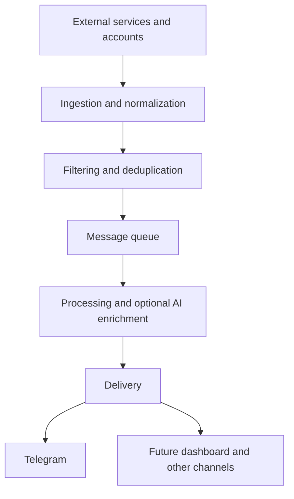

# Architecture

Status: proposed; the service directories exist, but their behavior is not implemented.

## Intended event flow

## Proposed responsibilities

| Component | Responsibility |
| --- | --- |
| `backend/` | API, integration ingestion, normalization, filtering, and persistence |
| `ai-worker/` (`ai_worker` package) | Consume queued events and optionally enrich their content |
| `bot/` | Telegram delivery and bot interactions |
| `rabbitmq/` | Broker configuration, rather than application business logic |
| `nginx/` | Reverse proxy configuration |
| Future frontend | Next.js dashboard; no frontend directory exists yet |

PostgreSQL is intended for persistent data. RabbitMQ is intended to decouple processing stages. Redis should be introduced only for a concrete need. Queue topology, database ownership, and deployment boundaries remain open decisions.

## Reliability requirements

- Preserve the original or normalized title and content throughout processing.
- Deliver that content when AI is disabled, unavailable, times out, or returns invalid output.
- Separate AI failures from delivery failures; delivery failures need their own retry policy.
- Design consumers for redelivery and idempotent effects. Do not assume exactly-once delivery.
- Bound retries and provide a way to inspect and recover failed messages.

Before multi-user deployment, define account ownership, tenant isolation, authorization, and retention policies.
